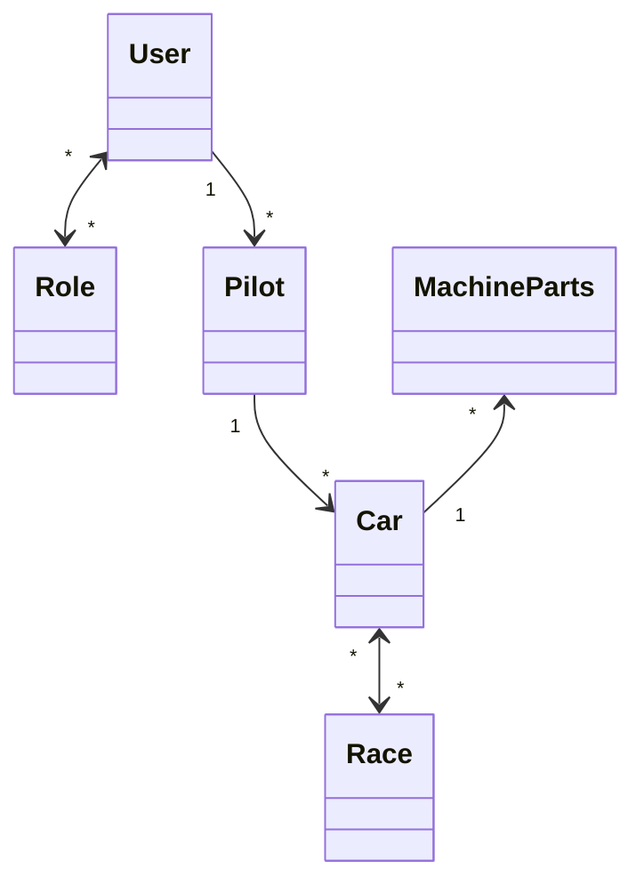

# Лабораторная работа №1

## Предметная область: Гоночная бригада команды формулы 1

### Пример архитектуры БД:

```mermaid
    classDiagram
    User "*" <--> "*" Role

    User "1" --> "*" Pilot
    Pilot "1" --> "*" Car
    Car "*" <--> "*" Race
    Machine Parts "*" <-- "1" Car
```

### Состав: 
Танковский Кирилл P34302
Мастюкина Мария P34302